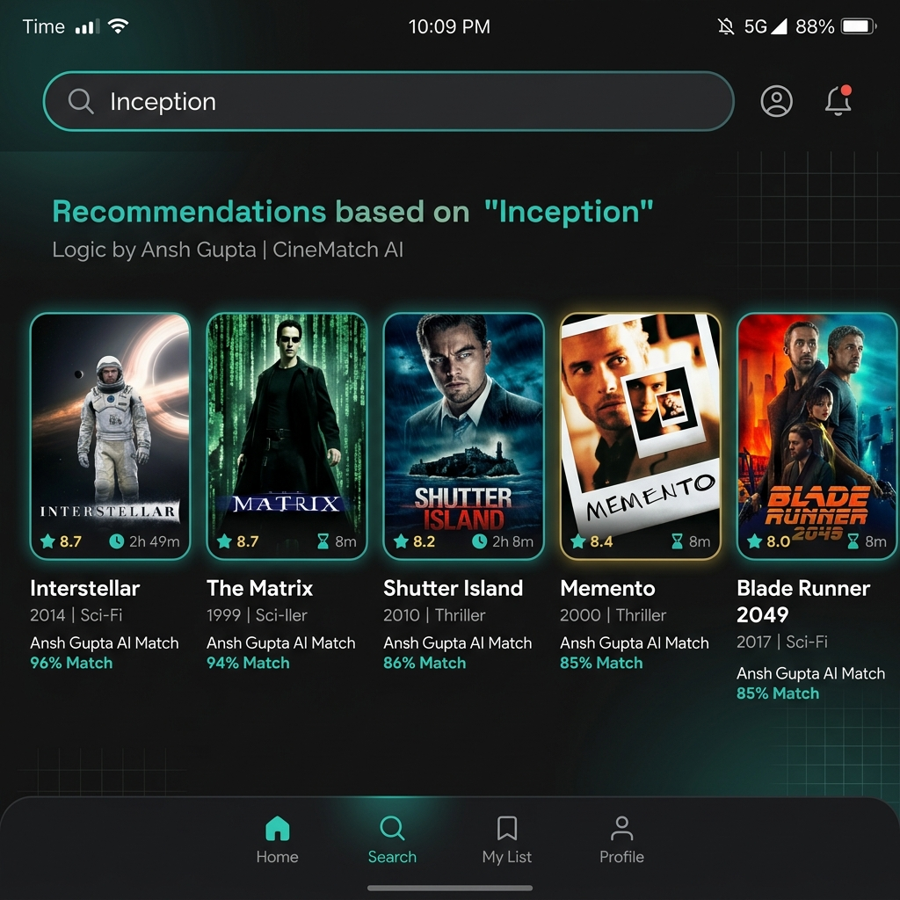
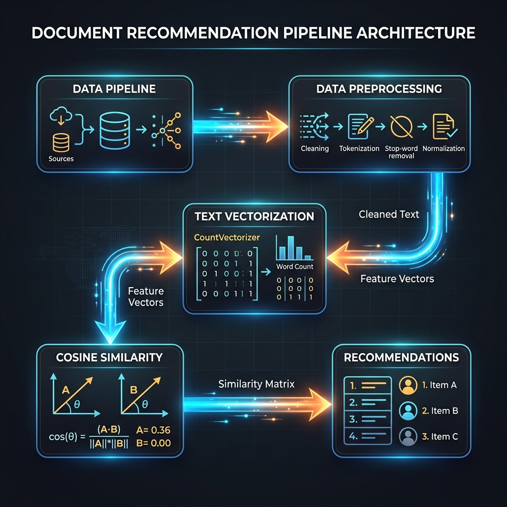
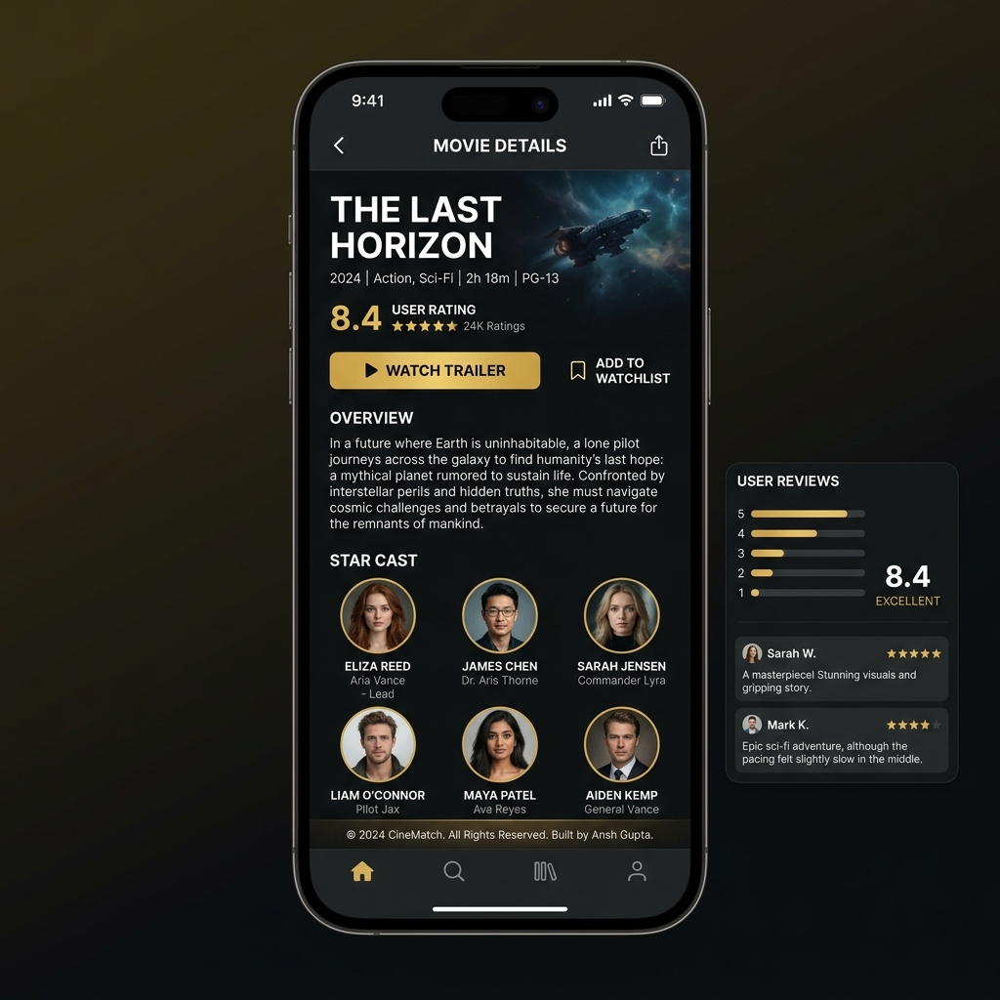

# 🎬 CineMatch – End-to-End Movie Recommendation System

> An intelligent content-based movie recommendation engine built with 
> Python, NLP, and Streamlit — by **Ansh Gupta**


---

## 📌 Table of Contents
- [About the Project](#about-the-project)
- [Demo](#demo)
- [Features](#features)
- [Tech Stack](#tech-stack)
- [How It Works](#how-it-works)
- [Project Structure](#project-structure)
- [Getting Started](#getting-started)
- [Screenshots](#screenshots)
- [Author](#author)

---

## 🧠 About the Project
CineMatch is a robust content-based movie recommendation engine built meticulously from scratch by Ansh Gupta. It leverages Natural Language Processing to analyze movie overviews, genres, casts, and crews. Through vectorization and cosine similarity, it compares your queried movie against over 5000 records to provide highly accurate, tailored suggestions in a fast, interactive Streamlit-style layout.

## 🎥 Demo


## ✨ Features
- 🎯 Content-based filtering using NLP
- 🔍 Search any movie and get top 5 recommendations
- 🖼️ Fetches movie posters via TMDB API
- ⚡ Fast and interactive Streamlit UI
- 📊 Built on 5000+ movie dataset

## 🛠️ Tech Stack
| Technology | Usage |
|---|---|
| Python | Core language |
| Streamlit / Flask | Frontend UI |
| Scikit-learn | ML & Cosine Similarity |
| NLTK | NLP & Stemming |
| TMDB API | Movie posters |
| Pandas & NumPy | Data processing |

## ⚙️ How It Works
1. **Data Preprocessing:** Movies dataset is cleaned and features like cast, crew, and genres are combined into tags.
2. **Text Vectorization:** The textual tags are transformed into a matrix using `CountVectorizer`.
3. **Similarity Matrix:** Cosine Similarity is calculated to measure distances between movies.
4. **User Query:** User inputs a target movie via the frontend.
5. **Distance Computation:** The system identifies the top nearest neighbors for the queried movie.
6. **API Fetch & Render:** Posters and additional details are fetched dynamically via TMDB API to present the final UI.



## 📁 Project Structure
```text
End-to-End-Movie-Recommendation-System/
├── Artifacts/              # Core datasets & models
├── NoteBook_Experiments/   # Jupyter notebooks for data processing
├── static/                 # Static assets (JS/CSS)
├── templates/              # HTML frontend templates
├── app.py                  # Main application entry point
├── AUTHOR.md               # Author information
├── requirements.txt        # Python dependencies
└── README.md               # Project documentation
```

## 🚀 Getting Started
### Prerequisites
- Python 3.7+
- pip packet manager

### Installation
```bash
git clone https://github.com/anshgupta110805/End-to-End-Movie-Recommendation-System.git
cd End-to-End-Movie-Recommendation-System
pip install -r requirements.txt
```

### Running the App
```bash
python app.py
```

## 📸 Screenshots



## 👨‍💻 Author

**Ansh Gupta**  
[](https://github.com/anshgupta110805)

---
⭐ If you liked this project, give it a star!
